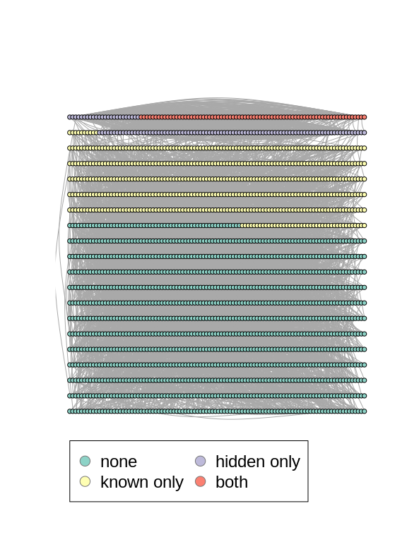

# hiddenmeta  [](https://codecov.io/gh/gerasy1987/hiddenmeta) [](https://github.com/gerasy1987/hiddenmeta/blob/main/LICENSE)

## Install and load packages

``` r
install.packages("DeclareDesign")
install.packages("igraph")

devtools::install_github("gerasy1987/hiddenmeta", build_vignettes = TRUE)
```

``` r
library(hiddenmeta)
library(DeclareDesign)
library(igraph)
```

## Step 1. Provide study design features

``` r
## STUDY 1
study_1 <- 
  list(
    pop = 
      list(
        handler = get_study_population,
        network_handler = sim_block_network,
        network_handler_args = 
          list(N = 2000, K = 2, prev_K = c(known = .3, hidden = .1), rho_K = .05,
               p_edge_within = list(known = c(0.05, 0.05), hidden = c(0.05, 0.9)),
               p_edge_between = list(known = 0.05, hidden = 0.01),
               directed = FALSE),
        
        group_names = c("known", "hidden"),
        
        # probability of visibility (show-up) for each group
        p_visibility = list(known = .99, hidden = .7),
        
        # probability of service utilization in hidden population
        # for service multiplier
        add_groups = list(p_service = 0.3, 
                          loc_1 = 0.3, loc_2 = 0.1, loc_3 = 0.2, 
                          known_2 = 0.1, known_2 = 0.2)
      ),
    sample = 
      list(
        rds = list(handler = sample_rds,
                   # RDS parameters
                   sampling_variable = "rds",
                   n_seed = 20,
                   n_coupons = 3,
                   target_type = "sample",
                   target_n_rds = 100),
        tls = list(handler = sample_tls,
                   sampling_variable = "tls",
                   # TLS sampling parameters
                   target_n_tls = 1),
        pps = list(handler = sample_pps,
                   sampling_variable = "pps",
                   # prop sampling parameters
                   target_n_pps = 400)
      ),
    estimands = list(handler = get_study_estimands),
    estimators = 
      list(
        rds = 
          list(sspse = list(handler = get_study_est_sspse, 
                            label = "rds_sspse",
                            prior_median = 150,
                            rds_prefix = "rds"),
               chords = list(handler = get_study_est_chords,  
                             type = "integrated", 
                             label = "rds_chords")),
        pps = 
          list(ht = list(handler = get_study_est_ht, 
                         label = "pps_ht"),
               nsum = list(handler = get_study_est_nsum, 
                           label = "pps_nsum"))
      )
  )
```

## Step 2. Declare study population

``` r
study_population <-
  do.call(what = declare_population,
          args = study_1$pop)

set.seed(19872312)
( example_pop <- study_population() )
#> # A tibble: 2,000 x 32
#>     name known hidden type  p_visibility_kn… known_visible p_visibility_hi…
#>    <int> <int>  <int> <chr>            <dbl>         <dbl>            <dbl>
#>  1     1     0      0 00               1                 1            0.700
#>  2     2     0      0 00               1.00              1            0.717
#>  3     3     0      0 00               0.994             1            0.683
#>  4     4     0      0 00               1.00              0            0.642
#>  5     5     0      0 00               1                 1            0.709
#>  6     6     0      0 00               1                 1            0.675
#>  7     7     0      0 00               0.968             1            0.688
#>  8     8     0      0 00               1.00              1            0.740
#>  9     9     0      0 00               1.00              0            0.739
#> 10    10     0      0 00               1.00              1            0.600
#> # … with 1,990 more rows, and 25 more variables: hidden_visible <dbl>,
#> #   type_visible_00 <dbl>, type_visible_01 <dbl>, type_visible_10 <dbl>,
#> #   type_visible_11 <dbl>, n_visible <dbl>, links <list>, total <int>,
#> #   p_service <int>, loc_1 <int>, loc_2 <int>, loc_3 <int>, known_2 <int>,
#> #   total_known <int>, total_hidden <int>, total_p_service <int>,
#> #   total_loc_1 <int>, total_loc_2 <int>, total_loc_3 <int>,
#> #   total_known_2 <int>, p_service_visible <dbl>, loc_1_visible <dbl>,
#> #   loc_2_visible <dbl>, loc_3_visible <dbl>, known_2_visible <dbl>
```

### Show the network

``` r
g <-
  example_pop %$% {
    igraph::graph_from_adj_list(links,
                                mode = "all") %>%
      igraph::set_vertex_attr("name", value = name) %>%
      igraph::set_vertex_attr("type", value = type)
  }

igraph::V(g)$color <-
  plyr::mapvalues(igraph::V(g)$type,
                  from = unique(igraph::V(g)$type),
                  to = grDevices::palette.colors(n = length(unique(igraph::V(g)$type)), palette = "Set 3"))

plot(g,
     layout = igraph::layout_on_grid(g, dim = 2, width = 100),
     vertex.size = 3, vertex.dist = 2, vertex.label = NA, edge.width = 1,
     edge.arrow.size = .2, edge.curved = .2)

legend(x = -1, y = -1.2,
       legend = c("none", "known only", "hidden only", "both"),
       pt.bg = grDevices::palette.colors(n = length(unique(igraph::V(g)$type)), palette = "Set 3"),
       pch = 21, col = "#777777", pt.cex = 2, cex = 1.5, bty = "o", ncol = 2)
```

<!-- -->

## Step 3. Declare all relevant study sampling procedures

The sampling procedures are additive in a sense that each procedure
appends several columns relevant to the sampling procedure and
particular draw based on population simulation, but does not change the
study population data frame (unless you specify
`drop_nonsampled = TRUE`).

``` r
study_sample_rds <- 
  do.call(what = declare_sampling, 
          args = study_1$sample$rds)

set.seed(19872312)
draw_data(study_population + study_sample_rds)
#> # A tibble: 2,000 x 41
#>     name known hidden type  p_visibility_kn… known_visible p_visibility_hi…
#>    <int> <int>  <int> <chr>            <dbl>         <dbl>            <dbl>
#>  1     1     0      0 00               1                 1            0.700
#>  2     2     0      0 00               1.00              1            0.717
#>  3     3     0      0 00               0.994             1            0.683
#>  4     4     0      0 00               1.00              0            0.642
#>  5     5     0      0 00               1                 1            0.709
#>  6     6     0      0 00               1                 1            0.675
#>  7     7     0      0 00               0.968             1            0.688
#>  8     8     0      0 00               1.00              1            0.740
#>  9     9     0      0 00               1.00              0            0.739
#> 10    10     0      0 00               1.00              1            0.600
#> # … with 1,990 more rows, and 34 more variables: hidden_visible <dbl>,
#> #   type_visible_00 <dbl>, type_visible_01 <dbl>, type_visible_10 <dbl>,
#> #   type_visible_11 <dbl>, n_visible <dbl>, links <list>, total <int>,
#> #   p_service <int>, loc_1 <int>, loc_2 <int>, loc_3 <int>, known_2 <int>,
#> #   total_known <int>, total_hidden <int>, total_p_service <int>,
#> #   total_loc_1 <int>, total_loc_2 <int>, total_loc_3 <int>,
#> #   total_known_2 <int>, p_service_visible <dbl>, loc_1_visible <dbl>,
#> #   loc_2_visible <dbl>, loc_3_visible <dbl>, known_2_visible <dbl>, rds <int>,
#> #   rds_from <int>, rds_t <dbl>, rds_wave <dbl>, rds_hidden <int>,
#> #   rds_own_coupon <chr>, rds_coupon_1 <chr>, rds_coupon_2 <chr>,
#> #   rds_coupon_3 <chr>
```

``` r
study_sample_pps <- 
  do.call(what = declare_sampling, 
          args = study_1$sample$pps)

set.seed(19872312)
draw_data(study_population + study_sample_rds + study_sample_pps)
#> # A tibble: 2,000 x 43
#>     name known hidden type  p_visibility_kn… known_visible p_visibility_hi…
#>    <int> <int>  <int> <chr>            <dbl>         <dbl>            <dbl>
#>  1     1     0      0 00               1                 1            0.700
#>  2     2     0      0 00               1.00              1            0.717
#>  3     3     0      0 00               0.994             1            0.683
#>  4     4     0      0 00               1.00              0            0.642
#>  5     5     0      0 00               1                 1            0.709
#>  6     6     0      0 00               1                 1            0.675
#>  7     7     0      0 00               0.968             1            0.688
#>  8     8     0      0 00               1.00              1            0.740
#>  9     9     0      0 00               1.00              0            0.739
#> 10    10     0      0 00               1.00              1            0.600
#> # … with 1,990 more rows, and 36 more variables: hidden_visible <dbl>,
#> #   type_visible_00 <dbl>, type_visible_01 <dbl>, type_visible_10 <dbl>,
#> #   type_visible_11 <dbl>, n_visible <dbl>, links <list>, total <int>,
#> #   p_service <int>, loc_1 <int>, loc_2 <int>, loc_3 <int>, known_2 <int>,
#> #   total_known <int>, total_hidden <int>, total_p_service <int>,
#> #   total_loc_1 <int>, total_loc_2 <int>, total_loc_3 <int>,
#> #   total_known_2 <int>, p_service_visible <dbl>, loc_1_visible <dbl>,
#> #   loc_2_visible <dbl>, loc_3_visible <dbl>, known_2_visible <dbl>, rds <int>,
#> #   rds_from <int>, rds_t <dbl>, rds_wave <dbl>, rds_hidden <int>,
#> #   rds_own_coupon <chr>, rds_coupon_1 <chr>, rds_coupon_2 <chr>,
#> #   rds_coupon_3 <chr>, pps_share <dbl>, pps <dbl>
```

``` r
study_sample_tls <- 
  do.call(what = declare_sampling, 
          args = study_1$sample$tls)

set.seed(19872312)
draw_data(study_population + 
            study_sample_rds + study_sample_pps + study_sample_tls)
#> # A tibble: 2,000 x 45
#>     name known hidden type  p_visibility_kn… known_visible p_visibility_hi…
#>    <int> <int>  <int> <chr>            <dbl>         <dbl>            <dbl>
#>  1     1     0      0 00               1                 1            0.700
#>  2     2     0      0 00               1.00              1            0.717
#>  3     3     0      0 00               0.994             1            0.683
#>  4     4     0      0 00               1.00              0            0.642
#>  5     5     0      0 00               1                 1            0.709
#>  6     6     0      0 00               1                 1            0.675
#>  7     7     0      0 00               0.968             1            0.688
#>  8     8     0      0 00               1.00              1            0.740
#>  9     9     0      0 00               1.00              0            0.739
#> 10    10     0      0 00               1.00              1            0.600
#> # … with 1,990 more rows, and 38 more variables: hidden_visible <dbl>,
#> #   type_visible_00 <dbl>, type_visible_01 <dbl>, type_visible_10 <dbl>,
#> #   type_visible_11 <dbl>, n_visible <dbl>, links <list>, total <int>,
#> #   p_service <int>, loc_1 <int>, loc_2 <int>, loc_3 <int>, known_2 <int>,
#> #   total_known <int>, total_hidden <int>, total_p_service <int>,
#> #   total_loc_1 <int>, total_loc_2 <int>, total_loc_3 <int>,
#> #   total_known_2 <int>, p_service_visible <dbl>, loc_1_visible <dbl>,
#> #   loc_2_visible <dbl>, loc_3_visible <dbl>, known_2_visible <dbl>, rds <int>,
#> #   rds_from <int>, rds_t <dbl>, rds_wave <dbl>, rds_hidden <int>,
#> #   rds_own_coupon <chr>, rds_coupon_1 <chr>, rds_coupon_2 <chr>,
#> #   rds_coupon_3 <chr>, pps_share <dbl>, pps <dbl>, tls_loc_sampled <chr>,
#> #   tls <dbl>
```

## Step 4. Declare study level estimands

``` r
study_estimands <- 
  do.call(what = declare_estimand, 
          args = study_1$estimands)

set.seed(19872312)
draw_estimands(study_population + 
                 study_sample_rds + study_sample_pps + study_sample_tls + 
                 study_estimands)
#>          estimand_label estimand
#> 1           hidden_size 190.0000
#> 2           hidden_prev   0.0950
#> 3        degree_average   5.0810
#> 4 degree_hidden_average   0.8655
```

## Step 5. Declare estimators used in the study

``` r
estimator_sspse <- do.call(what = declare_estimator, 
                           args = study_1$estimators$rds$sspse)
estimator_chords <- do.call(what = declare_estimator, 
                            args = study_1$estimators$rds$chords)
estimator_ht <- do.call(what = declare_estimator, 
                        args = study_1$estimators$pps$ht)
estimator_nsum <- do.call(what = declare_estimator, 
                          args = study_1$estimators$pps$nsum)

set.seed(19872312)
draw_estimates(study_population +
                 study_sample_rds + study_sample_pps + study_sample_tls +
                 study_estimands +
                 estimator_sspse + estimator_ht + estimator_chords + estimator_nsum)
#>            estimator_label    estimate          se        estimand_label
#> 1    hidden_size_rds_sspse 154.0000000 59.65263542           hidden_size
#> 2       hidden_prev_pps_ht   0.1056964  0.02155903           hidden_prev
#> 3   hidden_size_rds_chords 176.0000000          NA           hidden_size
#> 4 degree_hidden_rds_chords   6.1022727          NA degree_hidden_average
#> 5     hidden_size_pps_nsum 210.5490196 13.80913455           hidden_size
#> 6  degree_average_pps_nsum   4.9394673          NA        degree_average
```

## Step 6. Diagnose study design

``` r
study_diagnosands <-
 declare_diagnosands(
    mean_estimand = mean(estimand),
    mean_estimate = mean(estimate),
    sd_estimate = sd(estimate),
    mean_se = mean(se),
    bias = mean(estimate - estimand),
    rmse = sqrt(mean((estimate - estimand) ^ 2))
  )

diagnose_design(
  study_population + 
    study_sample_rds + study_sample_pps + 
    study_estimands + 
    estimator_sspse + estimator_ht + estimator_chords + estimator_nsum, 
  diagnosands = study_diagnosands,
  sims = 10,
  bootstrap_sims = 10)
```

## Meta-analysis Draft structure

1.  Get all estimates produced for each of the studies (depending on the
    design) in a single data frame that will include estimator and
    standard error for each estimator (or potentially for each
    sampling-estimator pair)
2.  Then we can *feed* this data frame into Stan model akin the one
    below
    1.  Use the data frame to produce observed estimator vectors for
        each estimator/sampling-estimator pair, `observed*`
    2.  Use the data frame produced by study designs to produce arrays
        of observed estimates and corresponding standard errors (with
        dummy value where missing), `est*` and `est*_sd`
    3.  Assume that deviation from true parameter of interest (`error`)
        is driven by use of estimator
3.  We then declare the relevant estimands and run diagnosis

``` r
stan_model_meta <- " 
  data {
    int<lower=0> N;   // number of studies 
    int<lower=0> K;   // max number of estimator (estimator-sampling pairs) 
    // number of studies with estimator (estimator-sampling pair)
    int<lower=0,upper=N> N1;
    int<lower=0,upper=N> N2;
    int<lower=0,upper=N> N3;
    // ids of studies with specific estimator (estimator-sampling pair)
    int<lower=0,upper=N> observed1[N1];   
    int<lower=0,upper=N> observed2[N2];
    int<lower=0,upper=N> observed3[N3];
    // parameter estimates
    real<lower=0,upper=1> est1[N1];   
    real<lower=0,upper=1> est2[N2];
    real<lower=0,upper=1> est3[N3];
    // estimated standard errors of parameter estimates
    real<lower=0> est1_sd[N1]; 
    real<lower=0> est2_sd[N2];
    real<lower=0> est3_sd[N3];
  }
  parameters {
    // (additive) error factor for each estimator/estimator-sampling pair
    real<lower=-1,upper=1> error[K]; 
    // prevalence estimate for each study
    vector<lower=0,upper=1>[N] alpha;
    // need to add Sigma to allow for interdependence of errors across estimators
    // or studies
  }

  model
    target += normal_lpmf(est1 | error[1] + alpha[observed1], est1_sd);
    target += normal_lpmf(est2 | error[2] + alpha[observed2], est2_sd);
    target += normal_lpmf(est3 | error[3] + alpha[observed3], est3_sd);
  }
  "

get_meta_estimands <- function(data) {
  
  data.frame(estimand_label = c(paste0("prevalence_", 1:N)),
             estimand = c(data[,1]),
             stringsAsFactors = FALSE)
}

get_meta_estimators = function(data) {
  
  stan_data <- list(N = nrow(data),
                    K = (ncol(data)-1)/2)
  
  for (k in 1:stan_data$K) {
    stan_data[[ paste0("observed",k) ]] <- 
      which(!is.na(data[,(2 * k)]))
    stan_data[[ paste0("N",k) ]] <- 
      length(stan_data[[paste0("observed",k)]])
    stan_data[[ paste0("est",k) ]] <- 
      data[stan_data[[paste0("observed",k)]],(2 * k)]
    stan_data[[ paste0("est",k,"_sd") ]] <- 
      data[stan_data[[paste0("observed",k)]],(1 + 2 * k)]
  }
  
  fit <- 
    rstan::stan(fit = stan_model_meta, 
                data = stan_data, 
                iter = 4000) %>% 
    extract
  
  data.frame(estimator_label = c(paste0("prev_", 1:N)),
             estimate = c(apply(fit$alpha, 2, mean)),
             sd =   c(apply(fit$alpha, 2, sd)),
             estimand_label = c(paste0("hidden_prev", 1:N)),
             big_Rhat = big_Rhat
             )
  
  }
```

## Meta declaration

### Additional study

``` r
study_2 <- 
  list(
    pop = 
      list(
        handler = get_study_population,
        network_handler = sim_block_network,
        network_handler_args = 
          list(N = 5000, K = 3, 
               prev_K = c(known_1 = .3, known_2 = .2, known_3 = .1), 
               rho_K = c(.1, .1, .1),
               p_edge_within = list(known_1 = c(0.2, 0.2), 
                                    known_2 = c(0.2, 0.2), 
                                    hidden = c(0.1, 0.9)),
               p_edge_between = list(known_1 = 0.1, 
                                     known_2 = 0.1, 
                                     hidden = 0.01),
               directed = FALSE),
        
        group_names = c("known_1", "known_2", "hidden"),
        
        # probability of visibility (show-up) for each group
        p_visibility = list(known_1 = .99, known_2 = .99, hidden = .6),
        
        # probability of service utilization in hidden population
        # for service multiplier
        add_groups = list(p_service = 0.3, 
                          loc_1 = 0.3, loc_2 = 0.1, loc_3 = 0.2)
      ),
    sample = 
      list(
        rds = list(handler = sample_rds,
                   # RDS parameters
                   sampling_variable = "rds",
                   n_seed = 100,
                   n_coupons = 3,
                   target_type = "waves",
                   target_n_rds = 2),
        pps = list(handler = sample_pps,
                   sampling_variable = "pps",
                   # prop sampling parameters
                   target_n_pps = 1000)
      ),
    estimands = list(handler = get_study_estimands),
    estimators = 
      list(
        rds = 
          list(
            chords = list(handler = get_study_est_chords, 
                          type = "integrated",
                          label = "rds_chords")
          ),
        pps = 
          list(
            ht = list(handler = get_study_est_ht, label = "pps_ht"),
            nsum = list(handler = get_study_est_nsum, label = "pps_nsum")
          )
      )
  )
```

### Declare multiple studies

``` r
pops_args <- 
  list(study_1 = study_1$pop,
       study_2 = study_2$pop)

samples_args <- 
  list(study_1 = study_1$sample,
       study_2 = study_2$sample)

estimators_args <- 
  list(study_1 = study_1$estimators,
       study_2 = study_2$estimators)

estimands_args <- 
  list(study_1 = study_1$estimands,
       study_2 = study_2$estimands)


multi_population <- 
  declare_population(handler = get_multi_populations, 
                     pops_args = pops_args)

multi_sampling <- 
  declare_sampling(handler = get_multi_samples, 
                   samples_args = samples_args) 

multi_estimands <- 
  declare_estimand(handler = get_multi_estimands, 
                   estimands_args = estimands_args) 

multi_estimators <-
  declare_estimator(handler = get_multi_estimates,
                    estimators_args = estimators_args)

multi_design <- multi_population + multi_sampling + multi_estimands + multi_estimators

set.seed(19872312)

draw_data(multi_population + multi_sampling + multi_estimands + multi_estimators)
#> # A tibble: 5 x 3
#>   study   sample population           
#>   <chr>   <chr>  <list>               
#> 1 study_1 rds    <tibble [2,000 × 41]>
#> 2 study_1 tls    <tibble [2,000 × 34]>
#> 3 study_1 pps    <tibble [2,000 × 34]>
#> 4 study_2 rds    <tibble [5,000 × 46]>
#> 5 study_2 pps    <tibble [5,000 × 39]>
draw_estimands(multi_population + multi_sampling + multi_estimands + multi_estimators)
#>                  estimand_label estimand
#> 1           study_1_hidden_size 213.0000
#> 2           study_1_hidden_prev   0.1065
#> 3        study_1_degree_average   5.2460
#> 4 study_1_degree_hidden_average   1.1085
#> 5           study_2_hidden_size 496.0000
#> 6           study_2_hidden_prev   0.0992
#> 7        study_2_degree_average  12.3364
#> 8 study_2_degree_hidden_average   1.1536
draw_estimates(multi_population + multi_sampling + multi_estimands + multi_estimators)
#>             estimator_label    estimate          se
#> 1     hidden_size_rds_sspse 225.5000000 74.29794856
#> 2    hidden_size_rds_chords 308.0000000          NA
#> 3  degree_hidden_rds_chords   6.3701299          NA
#> 4        hidden_prev_pps_ht   0.1137713  0.02153610
#> 5      hidden_size_pps_nsum 264.4380265 14.88173926
#> 6   degree_average_pps_nsum   5.1807980          NA
#> 7    hidden_size_rds_chords 561.0000000          NA
#> 8  degree_hidden_rds_chords   6.3689840          NA
#> 9        hidden_prev_pps_ht   0.1243481  0.01575626
#> 10     hidden_size_pps_nsum 394.7357811 14.75727131
#> 11  degree_average_pps_nsum   8.3473558          NA
#>                   estimand_label
#> 1            study_1_hidden_size
#> 2            study_1_hidden_size
#> 3  study_1_degree_hidden_average
#> 4            study_1_hidden_prev
#> 5            study_1_hidden_size
#> 6         study_1_degree_average
#> 7            study_2_hidden_size
#> 8  study_2_degree_hidden_average
#> 9            study_2_hidden_prev
#> 10           study_2_hidden_size
#> 11        study_2_degree_average
```
