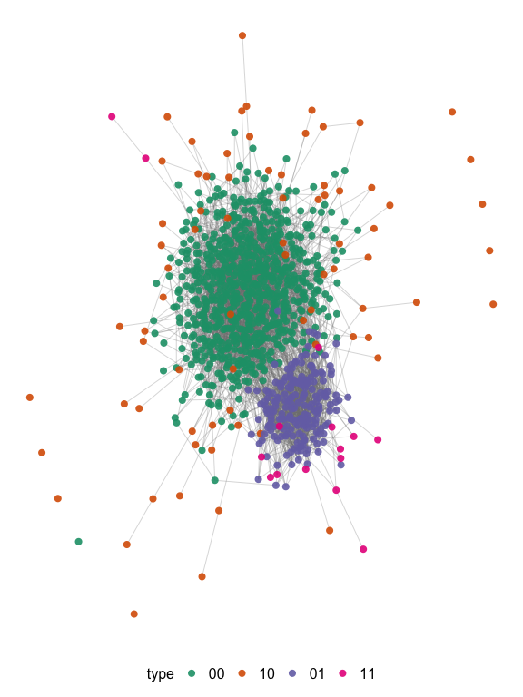

# hiddenmeta  [](https://codecov.io/gh/gerasy1987/hiddenmeta) [](https://github.com/gerasy1987/hiddenmeta/blob/main/LICENSE)

## Install and load packages

``` r
install.packages("DeclareDesign")
install.packages("igraph")

devtools::install_github("gerasy1987/hiddenmeta", build_vignettes = TRUE)
```

``` r
library(hiddenmeta)
library(DeclareDesign)
library(knitr)
```

## Step 1. Provide study design features

``` r
## STUDY 1
study_1 <- 
  list(
    pop = 
      list(
        handler = get_study_population,
        
        # network structure setup
        network_handler = sim_block_network,
        network_handler_args = 
          list(N = 1000, K = 2, prev_K = c(known = .3, hidden = .1), rho_K = 0,
               p_edge_within = list(known = c(0.1, 0.3), hidden = c(0.1, 0.3)),
               p_edge_between = list(known = 0.1, hidden = 0.1),
               directed = FALSE),
        
        # groups
        group_names = c("known", "hidden"),
        
        # probability of visibility (show-up) for each group
        p_visible = list(known = 1, hidden = 1),
        
        # probability of service utilization in hidden population
        # for service multiplier
        add_groups = 
          list(service_use = "rbinom(n(), 1, 0.25)",
         "purrr::map_df(hidden, ~ sapply( `names<-`(rep(0, times = 10), paste0('loc_', 1:10)), function(add) rbinom(length(.x), 1, 0.1 + .x * add)))",
         known_2 = 0.3, known_3 = 0.3)
      ),
    sample = 
      list(
        rds = list(handler = sample_rds,
                   # RDS parameters
                   sampling_variable = "rds",
                   hidden_var = "hidden", # default
                   n_seed = 20,
                   n_coupons = 3,
                   add_seeds = 3,
                   target_type = "sample",
                   target_n_rds = 60),
        tls = list(handler = sample_tls,
                   sampling_variable = "tls",
                   # TLS sampling parameters
                   target_n_clusters = 4,
                   target_n_tls = 180,
                   cluster = paste0("loc_", 1:10)),
        pps = list(handler = sample_pps,
                   sampling_variable = "pps",
                   # prop sampling parameters
                   sampling_frame = NULL,
                   strata = NULL,
                   cluster = NULL,
                   target_n_pps = 200)
      ),
    inquiries = list(handler = get_study_estimands,
                     known_pattern = "^known$", 
                     hidden_var = "hidden"),
    estimators = 
      list(
        rds = 
          list(sspse = list(handler = get_study_est_sspse,
                            prior_mean = 100,
                            mcmc_params = list(interval = 5, burnin = 2000, samplesize = 500),
                            total = 1000,
                            rds_prefix = "rds", 
                            label = "rds_sspse"),
               chords = list(handler = get_study_est_chords, 
                             type = "mle",
                             seed_condition = "rds_from == -999",
                             n_boot = 100,
                             rds_prefix = "rds",
                             label = "rds_chords"),
               multiplier = list(handler = get_study_est_multiplier, 
                                 service_var = "service_use",
                                 seed_condition = "rds_from == -999",
                                 n_boot = 100,
                                 rds_prefix = "rds",
                                 label = "rds_multi")),
        tls =
          list(ht = list(handler = get_study_est_ht,
                         weight_var = "tls_weight",
                         prefix = "tls",
                         label = "tls_ht"),
               nsum = list(handler = get_study_est_nsum,
                           known = c("known", "known_2", "known_3"),
                           hidden = "hidden_visible_out",
                           survey_design = ~ tls_cluster,
                           n_boot = 100,
                           prefix = "tls",
                           label = "tls_nsum"),
               recap = list(handler = get_study_est_recapture,
                            capture_parse = 
                              "strsplit(x = unique(na.omit(tls_locs_sampled)), split = ';')[[1]]",
                            sample_condition = "tls == 1",
                            model = "Mt",
                            hidden_variable = "hidden",
                            label = "tls_recap")),
        pps = 
          list(ht = list(handler = get_study_est_ht,
                         prefix = "pps",
                         label = "pps_ht"),
               nsum = list(handler = get_study_est_nsum,
                           known = c("known", "known_2", "known_3"),
                           hidden = "hidden_visible_out",
                           survey_design = ~ pps_cluster + strata(pps_strata),
                           n_boot = 100,
                           prefix = "pps",
                           label = "pps_nsum")),
        all = 
          list(recap1 = list(handler = get_study_est_recapture,
                             capture_vars = c("rds", "pps"),
                             model = "Mt",
                             hidden_variable = "hidden",
                             label = "rds_pps_recap"),
               recap2 = list(handler = get_study_est_recapture,
                             capture_vars = c("rds"),
                             capture_parse = 
                              "strsplit(x = unique(na.omit(tls_locs_sampled)), split = ';')[[1]]",
                             model = "Mt",
                             hidden_variable = "hidden",
                             label = "rds_tls_recap"))
      )
  )
```

## Step 2. Declare study population

``` r
study_population <-
  eval(as.call(c(list(declare_population), study_1$pop)))

set.seed(872312)
example_pop <- study_population()

example_pop %>% 
  dplyr::sample_n(n()) 
#> # A tibble: 1,000 × 75
#>     name type  known hidden links      service_use loc_1 loc_2 loc_3 loc_4 loc_5
#>    <int> <chr> <int>  <int> <chr>            <int> <int> <int> <int> <int> <int>
#>  1   583 00        0      0 215;310;6…           0     0     0     0     0     0
#>  2   140 00        0      0 19;53;437…           1     0     0     0     0     0
#>  3   670 10        1      0 1;90;103;…           0     0     0     0     0     0
#>  4   218 00        0      0 102;280;8…           1     0     0     0     0     0
#>  5    97 00        0      0 139;198;2…           0     0     0     1     0     0
#>  6    99 00        0      0 16;95;244…           0     0     1     0     0     0
#>  7   116 00        0      0 62;88;127…           1     0     0     0     0     0
#>  8   899 10        1      0 168;191;4…           1     0     0     1     0     0
#>  9   753 10        1      0 40;288;41…           1     0     0     0     0     0
#> 10   845 10        1      0 304;448;5…           1     0     0     0     0     0
#> # … with 990 more rows, and 64 more variables: loc_6 <int>, loc_7 <int>,
#> #   loc_8 <int>, loc_9 <int>, loc_10 <int>, known_2 <int>, known_3 <int>,
#> #   n_visible_out <dbl>, known_visible_out <dbl>, hidden_visible_out <dbl>,
#> #   type_00_visible_out <dbl>, type_01_visible_out <dbl>,
#> #   type_10_visible_out <dbl>, type_11_visible_out <dbl>,
#> #   service_use_visible_out <dbl>, loc_1_visible_out <dbl>,
#> #   loc_2_visible_out <dbl>, loc_3_visible_out <dbl>, …
```

### Show the network

``` r
g <-
  example_pop %$% {
    hiddenmeta:::retrieve_graph(links) %>%
      igraph::set_vertex_attr("name", value = name) %>%
      igraph::set_vertex_attr("type", value = type)
  }

igraph::V(g)$color <-
  plyr::mapvalues(igraph::V(g)$type,
                  from = unique(igraph::V(g)$type),
                  to = grDevices::palette.colors(n = length(unique(igraph::V(g)$type)), 
                                                 palette = "Set 3"))

plot(g,
     # layout = igraph::layout_on_grid(g, dim = 2, width = 100),
     layout = igraph::layout_on_grid(g, dim = 2, width = 150),
     vertex.size = 1.5, vertex.dist = 4, vertex.label = NA, edge.width = .2,
     edge.arrow.size = .2, edge.curved = .2)

legend(x = -1, y = -1.2,
       legend = c("none", "known only", "hidden only", "both"),
       pt.bg = grDevices::palette.colors(n = length(unique(igraph::V(g)$type)), palette = "Set 3"),
       pch = 21, col = "#777777", pt.cex = 1, cex = 1, bty = "o", ncol = 2)
```

<!-- -->

## Step 3. Declare all relevant study sampling procedures

The sampling procedures are additive in a sense that each procedure
appends several columns relevant to the sampling procedure and
particular draw based on population simulation, but does not change the
study population data frame (unless you specify
`drop_nonsampled = TRUE`).

``` r
study_sample_rds <- 
  eval(as.call(c(list(declare_sampling), study_1$sample$rds)))

set.seed(872312)
draw_data(study_population + study_sample_rds) %>%  
  dplyr::sample_n(n()) 
#> # A tibble: 1,000 × 84
#>     name type  known hidden links      service_use loc_1 loc_2 loc_3 loc_4 loc_5
#>    <int> <chr> <int>  <int> <chr>            <int> <int> <int> <int> <int> <int>
#>  1     6 00        0      0 207;243;3…           0     0     0     0     0     0
#>  2   100 00        0      0 253;364;5…           1     0     0     0     0     0
#>  3   502 00        0      0 59;183;19…           0     0     0     0     0     0
#>  4   741 10        1      0 178;256;3…           0     0     0     0     0     0
#>  5   971 11        1      1 16;46;75;…           0     0     1     0     0     0
#>  6   102 00        0      0 56;63;78;…           0     0     0     0     0     0
#>  7   204 00        0      0 34;85;219…           0     0     0     0     0     0
#>  8   764 10        1      0 215;250;6…           1     0     0     0     1     0
#>  9   193 00        0      0 10;20;208…           1     0     1     0     0     0
#> 10   523 00        0      0 1;176;205…           1     0     0     0     0     0
#> # … with 990 more rows, and 73 more variables: loc_6 <int>, loc_7 <int>,
#> #   loc_8 <int>, loc_9 <int>, loc_10 <int>, known_2 <int>, known_3 <int>,
#> #   n_visible_out <dbl>, known_visible_out <dbl>, hidden_visible_out <dbl>,
#> #   type_00_visible_out <dbl>, type_01_visible_out <dbl>,
#> #   type_10_visible_out <dbl>, type_11_visible_out <dbl>,
#> #   service_use_visible_out <dbl>, loc_1_visible_out <dbl>,
#> #   loc_2_visible_out <dbl>, loc_3_visible_out <dbl>, …
```

``` r
study_sample_pps <- 
  eval(as.call(c(list(declare_sampling), study_1$sample$pps)))

set.seed(872312)
draw_data(study_population + study_sample_rds + study_sample_pps) %>% 
  dplyr::sample_n(n()) 
#> # A tibble: 1,000 × 92
#>     name type  known hidden links      service_use loc_1 loc_2 loc_3 loc_4 loc_5
#>    <int> <chr> <int>  <int> <chr>            <int> <int> <int> <int> <int> <int>
#>  1   171 00        0      0 216;217;5…           0     0     0     0     0     0
#>  2   214 00        0      0 29;114;12…           0     0     1     0     0     0
#>  3   589 00        0      0 36;845;858           0     0     0     0     0     0
#>  4   561 00        0      0 10;187;29…           0     0     0     0     0     0
#>  5   909 01        0      1 60;75;95;…           0     0     0     0     1     0
#>  6   682 10        1      0 55;157;16…           1     0     0     0     0     0
#>  7   421 00        0      0 83;268;44…           1     0     0     0     0     0
#>  8   347 00        0      0 315;337;3…           0     0     0     0     0     0
#>  9   595 00        0      0 43;48;50;…           1     0     0     0     0     0
#> 10   847 10        1      0 35;77;136…           0     0     0     0     0     0
#> # … with 990 more rows, and 81 more variables: loc_6 <int>, loc_7 <int>,
#> #   loc_8 <int>, loc_9 <int>, loc_10 <int>, known_2 <int>, known_3 <int>,
#> #   n_visible_out <dbl>, known_visible_out <dbl>, hidden_visible_out <dbl>,
#> #   type_00_visible_out <dbl>, type_01_visible_out <dbl>,
#> #   type_10_visible_out <dbl>, type_11_visible_out <dbl>,
#> #   service_use_visible_out <dbl>, loc_1_visible_out <dbl>,
#> #   loc_2_visible_out <dbl>, loc_3_visible_out <dbl>, …
```

``` r
study_sample_tls <- 
  eval(as.call(c(list(declare_sampling), study_1$sample$tls)))

set.seed(872312)
draw_data(study_population + 
            study_sample_rds + study_sample_pps + study_sample_tls) %>% 
  dplyr::sample_n(n()) 
#> # A tibble: 1,000 × 97
#>     name type  known hidden links      service_use loc_1 loc_2 loc_3 loc_4 loc_5
#>    <int> <chr> <int>  <int> <chr>            <int> <int> <int> <int> <int> <int>
#>  1   744 10        1      0 38;81;95;…           0     0     0     0     0     0
#>  2   574 00        0      0 93;120;19…           0     0     0     0     0     0
#>  3   278 00        0      0 182;226;3…           1     0     0     0     0     0
#>  4   798 10        1      0 10;408;44…           0     0     0     0     0     0
#>  5   318 00        0      0 65;98;133…           0     0     0     0     0     0
#>  6   526 00        0      0 181;267;2…           0     0     0     0     0     0
#>  7   512 00        0      0 47;405;72…           0     1     0     0     0     0
#>  8   682 10        1      0 55;157;16…           1     0     0     0     0     0
#>  9   556 00        0      0 362;413;5…           1     0     0     0     0     0
#> 10   656 10        1      0 12;464;46…           1     0     0     0     0     0
#> # … with 990 more rows, and 86 more variables: loc_6 <int>, loc_7 <int>,
#> #   loc_8 <int>, loc_9 <int>, loc_10 <int>, known_2 <int>, known_3 <int>,
#> #   n_visible_out <dbl>, known_visible_out <dbl>, hidden_visible_out <dbl>,
#> #   type_00_visible_out <dbl>, type_01_visible_out <dbl>,
#> #   type_10_visible_out <dbl>, type_11_visible_out <dbl>,
#> #   service_use_visible_out <dbl>, loc_1_visible_out <dbl>,
#> #   loc_2_visible_out <dbl>, loc_3_visible_out <dbl>, …
```

## Step 4. Declare study level estimands

``` r
study_estimands <- 
  eval(as.call(c(list(declare_inquiry), study_1$inquiries)))

set.seed(872312)
draw_estimands(study_population + 
                 # study_sample_rds + study_sample_pps + study_sample_tls + 
                 study_estimands)
#>                inquiry    estimand
#> 1           known_size 318.0000000
#> 2          hidden_size 100.0000000
#> 3           known_prev   0.3180000
#> 4          hidden_prev   0.1000000
#> 5 hidden_size_in_known  38.0000000
#> 6 hidden_prev_in_known   0.1194969
```

## Step 5. Declare estimators used in the study

``` r
est_sspse <- 
  eval(as.call(c(list(declare_estimator), study_1$estimators$rds$sspse)))
est_chords <- 
  eval(as.call(c(list(declare_estimator), study_1$estimators$rds$chords)))
est_multi <- 
  eval(as.call(c(list(declare_estimator), study_1$estimators$rds$multiplier)))

est_ht_pps <- 
  eval(as.call(c(list(declare_estimator), study_1$estimators$pps$ht)))
est_nsum_pps <- 
  eval(as.call(c(list(declare_estimator), study_1$estimators$pps$nsum)))

est_ht_tls <- 
  eval(as.call(c(list(declare_estimator), study_1$estimators$tls$ht)))
est_nsum_tls <- 
  eval(as.call(c(list(declare_estimator), study_1$estimators$tls$nsum)))
est_recap_tls <- 
  eval(as.call(c(list(declare_estimator), study_1$estimators$tls$recap)))

est_recap_rds_pps <- 
  eval(as.call(c(list(declare_estimator), study_1$estimators$all$recap1)))
est_recap_rds_tls <- 
  eval(as.call(c(list(declare_estimator), study_1$estimators$all$recap2)))

set.seed(872312)
draw_estimates(study_population +
                 study_sample_rds + study_sample_pps + study_sample_tls +
                 study_estimands +
                 est_sspse + est_chords + est_multi +
                 est_nsum_pps + est_ht_pps +
                 est_nsum_tls + est_ht_tls + est_recap_tls +
                 est_recap_rds_pps + est_recap_rds_tls)
#>                    estimator  estimate           se     inquiry
#> 1      hidden_size_rds_sspse 104.00000 2.630451e+01 hidden_size
#> 2     hidden_size_rds_chords  37.00000 2.404814e+01 hidden_size
#> 3      hidden_size_rds_multi 104.00000 2.932858e+01 hidden_size
#> 4       hidden_size_pps_nsum 101.81782 6.319471e+00 hidden_size
#> 5         hidden_size_pps_ht  85.00000 1.985434e+01 hidden_size
#> 6         hidden_prev_pps_ht   0.08500 1.985434e-02 hidden_prev
#> 7       hidden_size_tls_nsum 106.10675 2.365163e+00 hidden_size
#> 8         hidden_size_tls_ht   4.03000 8.516056e-01 hidden_size
#> 9         hidden_prev_tls_ht   0.00403 8.516056e-04 hidden_prev
#> 10     hidden_size_tls_recap  51.07147 2.145948e+01 hidden_size
#> 11 hidden_size_rds_pps_recap  98.81818 1.626866e+01 hidden_size
#> 12 hidden_size_rds_tls_recap  98.83460 9.774056e+00 hidden_size
```

## Step 6. Declare full study

``` r
study1 <- 
  study_population +
  study_sample_rds + study_sample_pps + study_sample_tls +
  study_estimands +
  est_sspse + est_chords + est_multi +
  est_nsum_pps + est_ht_pps +
  est_nsum_tls + est_ht_tls + est_recap_tls +
  est_recap_rds_pps + est_recap_rds_tls

# can draw one of the samples
study1$study_sample_rds(study1$study_population())
#> # A tibble: 1,000 × 84
#>     name type  known hidden links      service_use loc_1 loc_2 loc_3 loc_4 loc_5
#>    <int> <chr> <int>  <int> <chr>            <int> <int> <int> <int> <int> <int>
#>  1     1 00        0      0 11;136;41…           0     0     0     0     0     1
#>  2     2 00        0      0 88;181;24…           0     0     0     1     0     0
#>  3     3 00        0      0 41;82;260…           1     0     0     0     0     0
#>  4     4 00        0      0 24;212;61…           0     0     0     0     0     0
#>  5     5 00        0      0 43;69;72;…           0     1     0     0     0     0
#>  6     6 00        0      0 53;561;60…           1     0     0     0     1     0
#>  7     7 00        0      0 101;177;2…           0     0     0     0     0     0
#>  8     8 00        0      0 11;157;33…           0     0     0     0     0     1
#>  9     9 00        0      0 14;311;35…           0     0     0     0     0     0
#> 10    10 00        0      0 30;161;21…           0     0     0     0     0     1
#> # … with 990 more rows, and 73 more variables: loc_6 <int>, loc_7 <int>,
#> #   loc_8 <int>, loc_9 <int>, loc_10 <int>, known_2 <int>, known_3 <int>,
#> #   n_visible_out <dbl>, known_visible_out <dbl>, hidden_visible_out <dbl>,
#> #   type_00_visible_out <dbl>, type_01_visible_out <dbl>,
#> #   type_10_visible_out <dbl>, type_11_visible_out <dbl>,
#> #   service_use_visible_out <dbl>, loc_1_visible_out <dbl>,
#> #   loc_2_visible_out <dbl>, loc_3_visible_out <dbl>, …
# can draw full data
study1_data <- draw_data(study1)

# can draw estimands
study1$inquiry(study1_data)
#>                inquiry     estimand
#> 1           known_size 313.00000000
#> 2          hidden_size  95.00000000
#> 3           known_prev   0.31300000
#> 4          hidden_prev   0.09500000
#> 5 hidden_size_in_known  22.00000000
#> 6 hidden_prev_in_known   0.07028754
# can draw any of the estimators
study1$rds_sspse(study1_data)
#>               estimator estimate       se     inquiry
#> 1 hidden_size_rds_sspse    150.5 92.57726 hidden_size
study1$pps_ht(study1_data)
#>            estimator estimate          se     inquiry
#> 1 hidden_size_pps_ht   110.00 23.66712443 hidden_size
#> 2 hidden_prev_pps_ht     0.11  0.02366712 hidden_prev
study1$rds_pps_recap(study1_data)
#>                   estimator estimate       se     inquiry
#> 1 hidden_size_rds_pps_recap 92.53333 11.97572 hidden_size
```

## Step 7. Diagnose study design

``` r
requireNamespace(c("doParallel", "parallel"))
doParallel::registerDoParallel(cores = 7)

set.seed(872312)
study1_simulations <-
  plyr::llply(
    as.list(1:100),
    .fun = function(x) {
      base::suppressWarnings(
        DeclareDesign::simulate_design(study1, sims = 1) %>%
          dplyr::mutate(
            sim_ID = x
          )
      )
    },
    .parallel = TRUE
  ) %>%
  dplyr::bind_rows()

saveRDS(study1_simulations, "vignettes/study1_sim.rds")
```

``` r
study_diagnosands <-
 declare_diagnosands(
    mean_estimand = mean(estimand),
    mean_estimate = mean(estimate),
    sd_estimate = sd(estimate),
    mean_se = mean(se),
    bias = mean(estimate - estimand),
    rmse = sqrt(mean((estimate - estimand) ^ 2))
  )

study1_simulations <- readRDS(here::here("vignettes/study1_sim.rds"))

diagnose_design(simulations_df = study1_simulations, 
                diagnosands = study_diagnosands) %>% 
  reshape_diagnosis %>% select(-'Design')
#>                 Inquiry                 Estimator N Sims Mean Estimand
#> 1           hidden_prev        hidden_prev_pps_ht    100          0.10
#> 2                                                               (0.00)
#> 3           hidden_prev        hidden_prev_tls_ht    100          0.10
#> 4                                                               (0.00)
#> 5  hidden_prev_in_known                      <NA>    100          0.09
#> 6                                                               (0.00)
#> 7           hidden_size        hidden_size_pps_ht    100         95.17
#> 8                                                               (0.57)
#> 9           hidden_size      hidden_size_pps_nsum    100         95.17
#> 10                                                              (0.57)
#> 11          hidden_size    hidden_size_rds_chords    100         95.17
#> 12                                                              (0.57)
#> 13          hidden_size     hidden_size_rds_multi    100         95.17
#> 14                                                              (0.57)
#> 15          hidden_size hidden_size_rds_pps_recap    100         95.17
#> 16                                                              (0.57)
#> 17          hidden_size     hidden_size_rds_sspse    100         95.17
#> 18                                                              (0.57)
#> 19          hidden_size hidden_size_rds_tls_recap    100         95.17
#> 20                                                              (0.57)
#> 21          hidden_size        hidden_size_tls_ht    100         95.17
#> 22                                                              (0.57)
#> 23          hidden_size      hidden_size_tls_nsum    100         95.17
#> 24                                                              (0.57)
#> 25          hidden_size     hidden_size_tls_recap    100         95.17
#> 26                                                              (0.57)
#> 27 hidden_size_in_known                      <NA>    100         27.35
#> 28                                                              (0.34)
#> 29           known_prev                      <NA>    100          0.30
#> 30                                                              (0.00)
#> 31           known_size                      <NA>    100        301.35
#> 32                                                              (0.97)
#>    Mean Estimate SD Estimate Mean Se   Bias   RMSE
#> 1           0.11        0.03    0.02   0.01   0.03
#> 2         (0.00)      (0.00)  (0.00) (0.00) (0.00)
#> 3           0.00        0.00    0.00  -0.09   0.09
#> 4         (0.00)      (0.00)  (0.00) (0.00) (0.00)
#> 5             NA          NA      NA     NA     NA
#> 6             NA          NA      NA     NA     NA
#> 7         106.50       28.15   21.77  11.33  27.10
#> 8         (2.75)      (2.32)  (0.27) (2.45) (2.18)
#> 9          99.37       12.57    6.71   4.20   9.68
#> 10        (1.14)      (1.04)  (0.07) (0.76) (0.72)
#> 11         77.37       38.38   35.41 -17.80  43.65
#> 12        (3.95)      (2.28)  (0.81) (4.10) (1.92)
#> 13         91.42       13.31   23.72  -3.75  13.59
#> 14        (1.39)      (1.17)  (1.02) (1.39) (0.98)
#> 15        101.07       19.64   15.32   5.90  17.13
#> 16        (1.90)      (1.40)  (0.60) (1.62) (1.28)
#> 17        159.71       32.63   92.65  64.54  72.41
#> 18        (3.03)      (4.67)  (3.82) (3.04) (4.44)
#> 19         98.38       11.34   10.23   3.21  11.04
#> 20        (1.23)      (0.78)  (0.29) (1.12) (0.83)
#> 21          3.43        1.15    0.90 -91.74  91.91
#> 22        (0.11)      (0.07)  (0.02) (0.53) (0.54)
#> 23         98.73       14.26    7.60   3.56  11.03
#> 24        (1.53)      (1.10)  (0.31) (1.14) (0.86)
#> 25         33.72       15.29   13.19 -61.45  63.34
#> 26        (1.76)      (3.00)  (1.54) (1.70) (1.25)
#> 27            NA          NA      NA     NA     NA
#> 28            NA          NA      NA     NA     NA
#> 29            NA          NA      NA     NA     NA
#> 30            NA          NA      NA     NA     NA
#> 31            NA          NA      NA     NA     NA
#> 32            NA          NA      NA     NA     NA
```

## Multi study declaration

### Additional study

``` r
study_2 <- 
  list(
    pop = 
      list(
        handler = get_study_population,
        network_handler = sim_block_network,
        network_handler_args = 
          list(N = 5000, K = 3, 
               prev_K = c(frame = .5, known = .2, hidden = .1), 
               rho_K = c(.05, .05, .05),
               p_edge_within = list(frame = c(0.05, 0.05), 
                                    known = c(0.1, 0.05), 
                                    hidden = c(0.2, 0.9)),
               p_edge_between = list(frame = 0.05, 
                                     known = 0.1, 
                                     hidden = 0.01),
               directed = FALSE),
        
        group_names = c("frame", "known", "hidden"),
        
        # probability of visibility (show-up) for each group
        p_visible = list(frame = 1, known = 1, hidden = .6),
        
        # probability of service utilization in hidden population
        # for service multiplier
        
        add_groups = 
          list(service_use = "rbinom(n(), 1, 0.25 + hidden * 0.3)",
               "purrr::map_df(hidden, ~ sapply( `names<-`(runif(10, 0.05,.3), paste0('loc_', 1:10)), function(add) rbinom(length(.x), 1, 0.1 + .x * add)))",
               known_2 = 0.1, known_3 = 0.2)
      ),
    sample = 
      list(
        rds = list(handler = sample_rds,
                   # RDS parameters
                   sampling_variable = "rds",
                   hidden_var = "hidden",
                   n_seed = 100,
                   n_coupons = 3,
                   target_type = "waves",
                   target_n_rds = 2),
        tls = list(handler = sample_tls,
                   sampling_variable = "tls",
                   # TLS sampling parameters
                   target_n_clusters = 4,
                   target_n_tls = 300,
                   cluster = paste0("loc_", 1:8)),
        pps = list(handler = sample_pps,
                   sampling_variable = "pps",
                   # prop sampling parameters
                   sampling_frame = "frame",
                   strata = NULL,
                   cluster = NULL,
                   target_n_pps = 800)
      ),
    inquiries = list(handler = get_study_estimands,
                     known_pattern = "^known$|^frame$", 
                     hidden_var = "hidden"),
    estimators = 
      list(
        rds = 
          list(sspse = list(handler = get_study_est_sspse, 
                            label = "rds_sspse",
                            prior_mean = 450,
                            mcmc_params = list(interval = 5, burnin = 2000, samplesize = 500),
                            total = 5000,
                            rds_prefix = "rds"),
               chords = list(handler = get_study_est_chords, 
                             type = "mle",
                             label = "rds_chords",
                             seed_condition = "rds_from == -999",
                             n_boot = 100,
                             rds_prefix = "rds"),
               multiplier = list(handler = get_study_est_multiplier, 
                                 service_var = "service_use",
                                 seed_condition = "rds_from == -999",
                                 n_boot = 100,
                                 rds_prefix = "rds",
                                 label = "rds_multi")),
        tls =
          list(ht = list(handler = get_study_est_ht,
                         weight_var = "tls_weight",
                         prefix = "tls",
                         label = "tls_ht"),
               nsum = list(handler = get_study_est_nsum,
                           known = c("known", "frame"),
                           hidden = "hidden_visible_out",
                           survey_design = ~ tls_cluster,
                           n_boot = 100,
                           prefix = "tls",
                           label = "tls_nsum"),
               recap = list(handler = get_study_est_recapture,
                            capture_vars = paste0("loc_", 1:8),
                            sample_condition = "tls == 1",
                            model = "Mt",
                            hidden_variable = "hidden",
                            label = "tls_recap")),
        pps = 
          list(
            ht = list(handler = get_study_est_ht, 
                      label = "pps_ht"),
            nsum = list(handler = get_study_est_nsum,
                        known = c("frame", "known"),
                        hidden = "hidden_visible_out",
                        survey_design = ~ pps_cluster + strata(pps_strata),
                        n_boot = 100,
                        label = "pps_nsum")),
        all = 
          list(recap1 = list(handler = get_study_est_recapture,
                             capture_vars = c("rds", "pps"),
                             model = "Mt",
                             hidden_variable = "hidden",
                             label = "rds_pps_recap"),
               recap2 = list(handler = get_study_est_recapture,
                             capture_vars = c("rds", paste0("loc_", 1:8)),
                             model = "Mt",
                             hidden_variable = "hidden",
                             label = "rds_tls_recap"))
      )
  )

study_3 <- 
  list(
    pop = 
      list(
        handler = get_study_population,
        
        # network structure setup
        network_handler = sim_block_network,
        network_handler_args = 
          list(N = 2000, K = 2, prev_K = c(known = .3, hidden = .1), rho_K = .3,
               p_edge_within = list(known = c(0.05, 0.1), hidden = c(0.05, 0.7)),
               p_edge_between = list(known = 0.05, hidden = 0.05),
               directed = FALSE),
        
        # groups
        group_names = c("known", "hidden"),
        
        # probability of visibility (show-up) for each group
        p_visible = list(known = 1, hidden = .7),
        
        # probability of service utilization in hidden population
        # for service multiplier
        add_groups = 
          list(service_use = "rbinom(n(), 1, 0.25 + hidden * 0.05)",
         "purrr::map_df(hidden, ~ sapply( `names<-`(c(.2, .1, .3, .2), paste0('loc_', 1:4)), function(add) rbinom(length(.x), 1, 0.1 + .x * add)))",
         known_2 = 0.1, known_3 = 0.2)
      ),
    sample = 
      list(
        rds = list(handler = sample_rds,
                   # RDS parameters
                   sampling_variable = "rds",
                   hidden_var = "hidden", # default
                   n_seed = 20,
                   n_coupons = 3,
                   target_type = "sample",
                   target_n_rds = 100),
        tls = list(handler = sample_tls,
                   sampling_variable = "tls",
                   # TLS sampling parameters
                   target_n_clusters = 3,
                   target_n_tls = 300,
                   cluster = paste0("loc_", 1:4)),
        pps = list(handler = sample_pps,
                   sampling_variable = "pps",
                   # prop sampling parameters
                   sampling_frame = NULL,
                   strata = NULL,
                   cluster = NULL,
                   target_n_pps = 400)
      ),
    inquiries = list(handler = get_study_estimands,
                     known_pattern = "^known$", 
                     hidden_var = "hidden"),
    estimators = 
      list(
        rds = 
          list(sspse = list(handler = get_study_est_sspse,
                            prior_mean = 200,
                            mcmc_params = list(interval = 5, burnin = 2000, samplesize = 500),
                            total = 2000,
                            rds_prefix = "rds", 
                            label = "rds_sspse"),
               chords = list(handler = get_study_est_chords, 
                             type = "mle",
                             seed_condition = "rds_from == -999",
                             n_boot = 100,
                             rds_prefix = "rds",
                             label = "rds_chords"),
               multiplier = list(handler = get_study_est_multiplier, 
                                 service_var = "service_use",
                                 seed_condition = "rds_from == -999",
                                 n_boot = 100,
                                 rds_prefix = "rds",
                                 label = "rds_multi")),
        tls =
          list(ht = list(handler = get_study_est_ht,
                         weight_var = "tls_weight",
                         prefix = "tls",
                         label = "tls_ht"),
               nsum = list(handler = get_study_est_nsum,
                           known = c("known", "known_2", "known_3"),
                           hidden = "hidden_visible_out",
                           survey_design = ~ tls_cluster,
                           n_boot = 100,
                           prefix = "tls",
                           label = "tls_nsum"),
               recap = list(handler = get_study_est_recapture,
                            capture_vars = paste0("loc_", 1:4),
                            sample_condition = "tls == 1",
                            model = "Mt",
                            hidden_variable = "hidden",
                            label = "tls_recap")),
        pps = 
          list(ht = list(handler = get_study_est_ht,
                         prefix = "pps",
                         label = "pps_ht"),
               nsum = list(handler = get_study_est_nsum,
                           known = c("known", "known_2", "known_3"),
                           hidden = "hidden_visible_out",
                           survey_design = ~ pps_cluster + strata(pps_strata),
                           n_boot = 100,
                           prefix = "pps",
                           label = "pps_nsum")),
        all = 
          list(recap1 = list(handler = get_study_est_recapture,
                             capture_vars = c("rds", "pps"),
                             model = "Mt",
                             hidden_variable = "hidden",
                             label = "rds_pps_recap"),
               recap2 = list(handler = get_study_est_recapture,
                             capture_vars = c("rds", paste0("loc_", 1:4)),
                             model = "Mt",
                             hidden_variable = "hidden",
                             label = "rds_tls_recap"))
      )
  )
```

### Declare multiple studies

``` r
multi_population <- 
  declare_population(handler = get_multi_populations, 
                     pops_args = list(study_1 = study_1$pop,
                                      study_2 = study_2$pop,
                                      study_3 = study_3$pop))

multi_sampling <- 
  declare_sampling(handler = get_multi_samples, 
                   samples_args = list(study_1 = study_1$sample,
                                       study_2 = study_2$sample,
                                       study_3 = study_3$sample)) 

multi_inquiry <- 
  declare_inquiry(handler = get_multi_estimands, 
                  inquiries_args = list(study_1 = study_1$inquiries,
                                        study_2 = study_2$inquiries,
                                        study_3 = study_3$inquiries)) 

multi_estimators <-
  declare_estimator(handler = get_multi_estimates,
                    estimators_args = list(study_1 = study_1$estimators,
                                           study_2 = study_2$estimators,
                                           study_3 = study_3$estimators))

multi_study <- multi_population + multi_sampling + multi_inquiry + multi_estimators

set.seed(872312)
draw_estimands(multi_study)
#>                         inquiry     estimand
#> 1            study_1_known_size  318.0000000
#> 2           study_1_hidden_size  100.0000000
#> 3            study_1_known_prev    0.3180000
#> 4           study_1_hidden_prev    0.1000000
#> 5  study_1_hidden_size_in_known   38.0000000
#> 6  study_1_hidden_prev_in_known    0.1194969
#> 7            study_2_frame_size 2521.0000000
#> 8            study_2_known_size  955.0000000
#> 9           study_2_hidden_size  481.0000000
#> 10           study_2_frame_prev    0.5042000
#> 11           study_2_known_prev    0.1910000
#> 12          study_2_hidden_prev    0.0962000
#> 13 study_2_hidden_size_in_frame  269.0000000
#> 14 study_2_hidden_prev_in_frame    0.1067037
#> 15 study_2_hidden_size_in_known  114.0000000
#> 16 study_2_hidden_prev_in_known    0.1193717
#> 17           study_3_known_size  590.0000000
#> 18          study_3_hidden_size  211.0000000
#> 19           study_3_known_prev    0.2950000
#> 20          study_3_hidden_prev    0.1055000
#> 21 study_3_hidden_size_in_known  145.0000000
#> 22 study_3_hidden_prev_in_known    0.2457627
draw_estimates(multi_study)
#>                    estimator     estimate           se             inquiry
#> 1      hidden_size_rds_sspse 1.605000e+02 9.753111e+01 study_1_hidden_size
#> 2     hidden_size_rds_chords 7.800000e+01 2.823870e+01 study_1_hidden_size
#> 3      hidden_size_rds_multi 1.309091e+02 6.454313e+01 study_1_hidden_size
#> 4         hidden_size_tls_ht 4.211009e+00 9.546678e-01 study_1_hidden_size
#> 5         hidden_prev_tls_ht 4.211009e-03 9.546678e-04 study_1_hidden_prev
#> 6       hidden_size_tls_nsum 1.064848e+02 3.886880e+00 study_1_hidden_size
#> 7      hidden_size_tls_recap 6.589780e+01 2.827999e+01 study_1_hidden_size
#> 8         hidden_size_pps_ht 8.000000e+01 1.908098e+01 study_1_hidden_size
#> 9         hidden_prev_pps_ht 8.000000e-02 1.908098e-02 study_1_hidden_prev
#> 10      hidden_size_pps_nsum 1.166672e+02 7.370442e+00 study_1_hidden_size
#> 11 hidden_size_rds_pps_recap 7.876923e+01 9.173448e+00 study_1_hidden_size
#> 12 hidden_size_rds_tls_recap 1.330891e+02 1.584432e+01 study_1_hidden_size
#> 13     hidden_size_rds_sspse 4.455000e+02 5.135585e+02 study_2_hidden_size
#> 14    hidden_size_rds_chords 3.620000e+02 1.183849e+02 study_2_hidden_size
#> 15     hidden_size_rds_multi 5.552211e+02 3.551113e+01 study_2_hidden_size
#> 16        hidden_size_tls_ht 4.931919e+01 2.278566e+01 study_2_hidden_size
#> 17        hidden_prev_tls_ht 9.863838e-03 4.557133e-03 study_2_hidden_prev
#> 18      hidden_size_tls_nsum 7.399762e+02 7.900043e+01 study_2_hidden_size
#> 19     hidden_size_tls_recap 6.572491e+01 1.844387e+00 study_2_hidden_size
#> 20        hidden_size_pps_ht 2.574800e+02 2.704909e+01 study_2_hidden_size
#> 21        hidden_prev_pps_ht 5.149600e-02 5.409819e-03 study_2_hidden_prev
#> 22      hidden_size_pps_nsum 2.076163e+02 2.668073e+01 study_2_hidden_size
#> 23 hidden_size_rds_pps_recap 3.982973e+02 4.291845e+01 study_2_hidden_size
#> 24 hidden_size_rds_tls_recap 5.512353e+02 6.314687e+00 study_2_hidden_size
#> 25     hidden_size_rds_sspse 2.020000e+02 5.785078e+01 study_3_hidden_size
#> 26    hidden_size_rds_chords 1.240000e+02 4.652596e+01 study_3_hidden_size
#> 27     hidden_size_rds_multi 1.538462e+02 1.871419e+01 study_3_hidden_size
#> 28        hidden_size_tls_ht 3.246111e+01 4.537535e+00 study_3_hidden_size
#> 29        hidden_prev_tls_ht 1.623056e-02 2.268767e-03 study_3_hidden_prev
#> 30      hidden_size_tls_nsum 4.402019e+02 2.846223e+01 study_3_hidden_size
#> 31     hidden_size_tls_recap 6.692381e+01 4.172684e+00 study_3_hidden_size
#> 32        hidden_size_pps_ht 1.950000e+02 2.857143e+01 study_3_hidden_size
#> 33        hidden_prev_pps_ht 9.750000e-02 1.428571e-02 study_3_hidden_prev
#> 34      hidden_size_pps_nsum 2.901978e+02 1.988183e+01 study_3_hidden_size
#> 35 hidden_size_rds_pps_recap 2.010000e+02 2.791313e+01 study_3_hidden_size
#> 36 hidden_size_rds_tls_recap 1.791636e+02 5.769427e+00 study_3_hidden_size
```

### Diagnose multiple studies

``` r
# multi_simulations <- simulate_design(multi_study, sims = 2)

requireNamespace(c("doParallel", "parallel"))
doParallel::registerDoParallel(cores = 20)

set.seed(872312)
multi_simulations <-
  plyr::llply(
    as.list(1:100),
    .fun = function(x) {
      base::suppressWarnings(
        DeclareDesign::simulate_design(multi_study, sims = 1) %>%
          dplyr::mutate(
            sim_ID = x
          )
      )
    },
    .parallel = TRUE
  ) %>%
  dplyr::bind_rows()

saveRDS(multi_simulations, file = "vignettes/multi_sim.rds")
```

``` r
multi_simulations <- readRDS(here::here("vignettes/multi_sim.rds"))

diagnose_design(simulations_df = multi_simulations, 
                diagnosands = study_diagnosands) %>% 
  reshape_diagnosis(digits = 2) %>%
  dplyr::select(-'Design') %>%
  dplyr::filter(`Mean Estimate` != "NA")
#>                Inquiry                 Estimator N Sims Mean Estimand
#> 1  study_1_hidden_prev        hidden_prev_pps_ht    100          0.10
#> 2                                                              (0.00)
#> 3  study_1_hidden_prev        hidden_prev_tls_ht    100          0.10
#> 4                                                              (0.00)
#> 5  study_1_hidden_size        hidden_size_pps_ht    100        197.97
#> 6                                                              (1.54)
#> 7  study_1_hidden_size      hidden_size_pps_nsum    100        197.97
#> 8                                                              (1.54)
#> 9  study_1_hidden_size    hidden_size_rds_chords    100        197.97
#> 10                                                             (1.54)
#> 11 study_1_hidden_size     hidden_size_rds_multi    100        197.97
#> 12                                                             (1.54)
#> 13 study_1_hidden_size hidden_size_rds_pps_recap    100        197.97
#> 14                                                             (1.54)
#> 15 study_1_hidden_size     hidden_size_rds_sspse    100        197.97
#> 16                                                             (1.54)
#> 17 study_1_hidden_size hidden_size_rds_tls_recap    100        197.97
#> 18                                                             (1.54)
#> 19 study_1_hidden_size        hidden_size_tls_ht    100        197.97
#> 20                                                             (1.54)
#> 21 study_1_hidden_size      hidden_size_tls_nsum    100        197.97
#> 22                                                             (1.54)
#> 23 study_1_hidden_size     hidden_size_tls_recap    100        197.97
#> 24                                                             (1.54)
#> 25 study_2_hidden_prev        hidden_prev_pps_ht    100          0.10
#> 26                                                             (0.00)
#> 27 study_2_hidden_prev        hidden_prev_tls_ht    100          0.10
#> 28                                                             (0.00)
#> 29 study_2_hidden_size        hidden_size_pps_ht    100        497.63
#> 30                                                             (1.99)
#> 31 study_2_hidden_size      hidden_size_pps_nsum    100        497.63
#> 32                                                             (1.99)
#> 33 study_2_hidden_size    hidden_size_rds_chords    100        497.63
#> 34                                                             (1.99)
#> 35 study_2_hidden_size     hidden_size_rds_multi    100        497.63
#> 36                                                             (1.99)
#> 37 study_2_hidden_size hidden_size_rds_pps_recap    100        497.63
#> 38                                                             (1.99)
#> 39 study_2_hidden_size     hidden_size_rds_sspse    100        497.63
#> 40                                                             (1.99)
#> 41 study_2_hidden_size hidden_size_rds_tls_recap    100        497.63
#> 42                                                             (1.99)
#> 43 study_2_hidden_size        hidden_size_tls_ht    100        497.63
#> 44                                                             (1.99)
#> 45 study_2_hidden_size      hidden_size_tls_nsum    100        497.63
#> 46                                                             (1.99)
#> 47 study_2_hidden_size     hidden_size_tls_recap    100        497.63
#> 48                                                             (1.99)
#> 49 study_3_hidden_prev        hidden_prev_pps_ht    100          0.10
#> 50                                                             (0.00)
#> 51 study_3_hidden_prev        hidden_prev_tls_ht    100          0.10
#> 52                                                             (0.00)
#> 53 study_3_hidden_size        hidden_size_pps_ht    100        198.27
#> 54                                                             (1.19)
#> 55 study_3_hidden_size      hidden_size_pps_nsum    100        198.27
#> 56                                                             (1.19)
#> 57 study_3_hidden_size    hidden_size_rds_chords    100        198.27
#> 58                                                             (1.19)
#> 59 study_3_hidden_size     hidden_size_rds_multi    100        198.27
#> 60                                                             (1.19)
#> 61 study_3_hidden_size hidden_size_rds_pps_recap    100        198.27
#> 62                                                             (1.19)
#> 63 study_3_hidden_size     hidden_size_rds_sspse    100        198.27
#> 64                                                             (1.19)
#> 65 study_3_hidden_size hidden_size_rds_tls_recap    100        198.27
#> 66                                                             (1.19)
#> 67 study_3_hidden_size        hidden_size_tls_ht    100        198.27
#> 68                                                             (1.19)
#> 69 study_3_hidden_size      hidden_size_tls_nsum    100        198.27
#> 70                                                             (1.19)
#> 71 study_3_hidden_size     hidden_size_tls_recap    100        198.27
#> 72                                                             (1.19)
#>    Mean Estimate SD Estimate Mean Se    Bias    RMSE
#> 1           0.10        0.02    0.01   -0.00    0.01
#> 2         (0.00)      (0.00)  (0.00)  (0.00)  (0.00)
#> 3           0.02        0.00    0.00   -0.08    0.08
#> 4         (0.00)      (0.00)  (0.00)  (0.00)  (0.00)
#> 5         193.35       30.89   29.53   -4.62   24.71
#> 6         (3.19)      (2.75)  (0.30)  (2.47)  (1.82)
#> 7         279.14       33.59   19.84   81.17   84.20
#> 8         (3.31)      (2.42)  (0.20)  (2.13)  (2.24)
#> 9         135.47       49.91   48.94  -62.50   81.34
#> 10        (5.04)      (4.47)  (0.75)  (5.30)  (3.52)
#> 11        200.83       27.78   33.30    2.86   24.07
#> 12        (2.93)      (2.63)  (0.99)  (2.57)  (2.13)
#> 13        194.08       36.84   26.61   -3.89   33.07
#> 14        (3.97)      (6.96)  (1.29)  (3.46)  (5.96)
#> 15        215.03       30.65   86.46   17.06   39.76
#> 16        (3.11)      (1.89)  (2.35)  (3.74)  (2.75)
#> 17        198.25       16.19    6.65    0.28    6.98
#> 18        (1.82)      (1.16)  (0.11)  (0.73)  (0.48)
#> 19         37.23        5.52    4.41 -160.74  161.37
#> 20        (0.57)      (0.30)  (0.06)  (1.44)  (1.42)
#> 21        435.88       40.33   23.04  237.91  240.08
#> 22        (3.85)      (2.92)  (1.25)  (3.11)  (3.15)
#> 23         77.38        9.57    4.67 -120.59  121.37
#> 24        (1.07)      (0.56)  (0.11)  (1.29)  (1.26)
#> 25          0.06        0.01    0.01   -0.04    0.04
#> 26        (0.00)      (0.00)  (0.00)  (0.00)  (0.00)
#> 27          0.01        0.00    0.00   -0.09    0.09
#> 28        (0.00)      (0.00)  (0.00)  (0.00)  (0.00)
#> 29        283.39       25.43   27.63 -214.24  215.88
#> 30        (2.58)      (1.98)  (0.24)  (2.51)  (2.47)
#> 31        200.92       29.01   25.72 -296.71  297.93
#> 32        (2.94)      (2.68)  (0.32)  (2.53)  (2.47)
#> 33        224.92      209.24  146.13 -272.71  341.23
#> 34       (19.99)     (21.97)  (3.61) (19.48) (12.17)
#> 35        499.94       38.52   34.90    2.31   32.94
#> 36        (3.74)      (3.88)  (0.54)  (3.30)  (2.67)
#> 37        502.68       70.65   64.67    5.05   63.82
#> 38        (6.80)      (4.82)  (1.55)  (5.87)  (4.34)
#> 39       1412.37      814.71  315.04  914.74 1224.20
#> 40       (82.72)     (24.30) (21.86) (82.95) (56.26)
#> 41        497.73       21.68    5.72    0.10    6.26
#> 42        (2.11)      (1.83)  (0.04)  (0.64)  (0.44)
#> 43         53.44        6.68   23.24 -444.19  444.64
#> 44        (0.65)      (0.57)  (0.46)  (1.96)  (1.98)
#> 45        608.92      102.88   83.07  111.29  145.94
#> 46        (9.05)      (6.57)  (2.91)  (8.43)  (6.92)
#> 47         69.10        7.00    1.75 -428.53  429.02
#> 48        (0.70)      (0.49)  (0.03)  (2.00)  (2.02)
#> 49          0.10        0.02    0.01    0.00    0.01
#> 50        (0.00)      (0.00)  (0.00)  (0.00)  (0.00)
#> 51          0.02        0.00    0.00   -0.08    0.08
#> 52        (0.00)      (0.00)  (0.00)  (0.00)  (0.00)
#> 53        203.30       31.00   29.68    5.03   29.88
#> 54        (3.20)      (2.16)  (0.30)  (3.12)  (2.10)
#> 55        287.12       30.74   20.04   88.85   92.38
#> 56        (3.07)      (2.12)  (0.23)  (2.58)  (2.69)
#> 57        142.37       60.63   46.76  -55.90   82.89
#> 58        (5.84)      (3.76)  (0.66)  (5.93)  (3.59)
#> 59        198.45       22.55   33.73    0.18   19.24
#> 60        (2.20)      (1.34)  (0.73)  (1.90)  (1.27)
#> 61        194.45       21.97   25.82   -3.82   22.30
#> 62        (2.17)      (1.73)  (0.66)  (2.31)  (1.72)
#> 63        211.68       31.73   80.10   13.41   38.70
#> 64        (2.97)      (2.27)  (2.51)  (3.39)  (2.46)
#> 65        198.51       14.03    6.55    0.24    6.73
#> 66        (1.36)      (1.08)  (0.08)  (0.59)  (0.56)
#> 67         37.88        6.01    4.49 -160.39  160.73
#> 68        (0.56)      (0.43)  (0.05)  (1.10)  (1.11)
#> 69        431.78       37.01   20.59  233.51  235.62
#> 70        (3.71)      (2.44)  (1.08)  (3.20)  (3.20)
#> 71         77.27        9.46    4.61 -121.00  121.50
#> 72        (0.86)      (0.68)  (0.08)  (1.13)  (1.14)
```

## Meta-analysis structure

1.  Conduct multi-study design for as many sampling-estimator pairs in
    each study as possible, then diagnose the multi-study design.
    Calculate average (across simulations) estimand and bias of
    sampling-estimator for each of the studies and estimator sampling
    strategies. These will serve as population we will be drawing
    population-sampling-estimator triads

2.  Estimands include:

    -   Average estimand by inquiry label (within study)
    -   Average bias of specific sampling-estimator pair (across
        studies) compared to truth
    -   Average relative bias of sampling-estimator pair (across
        studies) compared to “gold standard”
    -   Ratio of average bias to costs of sampling-estimator pair

3.  As mentioned before sampling will consist of drawing
    population-sampling-estimator triads from the population presuming
    that each study uses at least two sampling strategies at a time

4.  Once we draw sample we use Stan model to estimate study-specific
    estimands and sampling-estimator specific errors (biases)

5.  We have all parts to conduct the full cycle of meta-analyses

``` r
meta_population <- 
  declare_population(multi_design = multi_study, n_sim = 3, parallel = FALSE, 
                     handler = get_meta_population)

meta_inquiry <- 
  declare_inquiry(study_estimand = "hidden_size",
                  samp_est_benchmark = "pps_ht", 
                  handler = get_meta_estimands)

meta_sample <- 
  declare_sampling(sampling_variable = "meta",
                   selection_variables = c("sample", "estimator"),
                   samples_per_study = 2, estimator_per_sample = 3, 
                   force = list(sample = "pps", estimator = "ht"),
                   handler = get_meta_sample)

meta_estimator <- 
  declare_estimator(sampling_variable = "meta",
                    which_estimand = "hidden_size",
                    benchmark = list(sample = "pps", estimator = "ht"),
                    parallel = FALSE,
                    stan_handler = get_meta_stan,
                    handler = get_meta_estimates)

meta_study <- meta_population + meta_inquiry + meta_sample + meta_estimator

set.seed(872312)
draw_estimands(meta_study)
#>                      inquiry      estimand
#> 1                bias_pps_ht  -75.57513889
#> 2              bias_pps_nsum  -71.47930727
#> 3            bias_rds_chords -109.55555556
#> 4             bias_rds_multi    6.04333120
#> 5         bias_rds_pps_recap   -8.15177122
#> 6             bias_rds_sspse  457.11111111
#> 7         bias_rds_tls_recap    0.93781976
#> 8             bias_sd_pps_ht  123.42649772
#> 9           bias_sd_pps_nsum  214.88331248
#> 10        bias_sd_rds_chords  165.38393973
#> 11         bias_sd_rds_multi   25.86888492
#> 12     bias_sd_rds_pps_recap   34.00018599
#> 13         bias_sd_rds_sspse  710.62768467
#> 14     bias_sd_rds_tls_recap    2.62627507
#> 15            bias_sd_tls_ht  183.36850717
#> 16          bias_sd_tls_nsum  124.44266073
#> 17         bias_sd_tls_recap  195.77162158
#> 18               bias_tls_ht -233.04254045
#> 19             bias_tls_nsum  124.62504782
#> 20            bias_tls_recap -203.36171786
#> 21           rel_bias_pps_ht    1.00000000
#> 22         rel_bias_pps_nsum    0.93688797
#> 23       rel_bias_rds_chords    1.47826256
#> 24        rel_bias_rds_multi   -0.05684819
#> 25    rel_bias_rds_pps_recap    0.12822462
#> 26        rel_bias_rds_sspse   -5.92939006
#> 27    rel_bias_rds_tls_recap   -0.01214965
#> 28        rel_bias_sd_pps_ht    1.00000000
#> 29      rel_bias_sd_pps_nsum    1.75370491
#> 30    rel_bias_sd_rds_chords    1.33026925
#> 31     rel_bias_sd_rds_multi    0.20081032
#> 32 rel_bias_sd_rds_pps_recap    0.27076736
#> 33     rel_bias_sd_rds_sspse    5.96938573
#> 34 rel_bias_sd_rds_tls_recap    0.02078051
#> 35        rel_bias_sd_tls_ht    1.50343075
#> 36      rel_bias_sd_tls_nsum    1.02050114
#> 37     rel_bias_sd_tls_recap    1.60349425
#> 38           rel_bias_tls_ht    3.12801152
#> 39         rel_bias_tls_nsum   -1.67607954
#> 40        rel_bias_tls_recap    2.72985805
#> 41       study_1_hidden_size   94.66666667
#> 42       study_2_hidden_size  490.33333333
#> 43       study_3_hidden_size  209.33333333
draw_estimates(meta_study)
#>                      estimator    estimate          se                inquiry
#> 1         rel_bias_pps_ht_meta   1.0000000  0.00000000        rel_bias_pps_ht
#> 2      rel_bias_rds_sspse_meta   9.0255787  0.96829395     rel_bias_rds_sspse
#> 3      rel_bias_rds_multi_meta   2.0092177  0.51220527     rel_bias_rds_multi
#> 4       rel_bias_pps_nsum_meta   1.2651668  0.13074009      rel_bias_pps_nsum
#> 5  rel_bias_rds_pps_recap_meta   2.0172260  0.28396824 rel_bias_rds_pps_recap
#> 6     rel_bias_rds_chords_meta   0.7451670  0.47353706    rel_bias_rds_chords
#> 7         rel_bias_tls_ht_meta   0.2008796  0.02908356        rel_bias_tls_ht
#> 8      rel_bias_tls_recap_meta   0.3716098  0.04257755     rel_bias_tls_recap
#> 9                 study_1_meta  68.6466563 15.11191777    study_1_hidden_size
#> 10                study_2_meta 363.3712115 73.25944316    study_2_hidden_size
#> 11                study_3_meta 308.6784268 63.88872797    study_3_hidden_size
```

``` r
requireNamespace(c("doParallel", "parallel"))
doParallel::registerDoParallel(cores = 20)

set.seed(872312)
meta_simulations <-
  plyr::llply(
    as.list(1:100),
    .fun = function(x) {
      base::suppressWarnings(
        DeclareDesign::simulate_design(meta_study, sims = 1) %>%
          dplyr::mutate(
            sim_ID = x
          )
      )
    },
    .parallel = TRUE
  ) %>%
  dplyr::bind_rows()

saveRDS(meta_simulations, file = "vignettes/meta_sim.rds")
```

``` r
meta_simulations <- readRDS(here::here("vignettes/meta_sim.rds"))

diagnose_design(simulations_df = meta_simulations, 
                diagnosands = study_diagnosands) %>% 
  reshape_diagnosis(digits = 2) %>%
  dplyr::select(-'Design') %>%
  dplyr::filter(`Mean Estimate` != "NA")
#>                   Inquiry                   Estimator N Sims Mean Estimand
#> 1         rel_bias_pps_ht        rel_bias_pps_ht_meta    100          1.00
#> 2                                                                   (0.00)
#> 3       rel_bias_pps_nsum      rel_bias_pps_nsum_meta    100          0.61
#> 4                                                                   (0.01)
#> 5     rel_bias_rds_chords    rel_bias_rds_chords_meta     65          2.05
#> 6                                                                   (0.07)
#> 7      rel_bias_rds_multi     rel_bias_rds_multi_meta     76         -0.04
#> 8                                                                   (0.02)
#> 9  rel_bias_rds_pps_recap rel_bias_rds_pps_recap_meta     88          0.00
#> 10                                                                  (0.02)
#> 11     rel_bias_rds_sspse     rel_bias_rds_sspse_meta     71         -4.88
#> 12                                                                  (0.29)
#> 13        rel_bias_tls_ht        rel_bias_tls_ht_meta     85          3.77
#> 14                                                                  (0.06)
#> 15      rel_bias_tls_nsum      rel_bias_tls_nsum_meta     72         -2.87
#> 16                                                                  (0.06)
#> 17     rel_bias_tls_recap     rel_bias_tls_recap_meta     69          3.34
#> 18                                                                  (0.06)
#> 19    study_1_hidden_size                study_1_meta    100        201.22
#> 20                                                                  (0.78)
#> 21    study_2_hidden_size                study_2_meta    100        500.18
#> 22                                                                  (1.28)
#> 23    study_3_hidden_size                study_3_meta    100        199.64
#> 24                                                                  (0.62)
#>    Mean Estimate SD Estimate Mean Se    Bias   RMSE
#> 1           1.00        0.00    0.00    0.00   0.00
#> 2         (0.00)      (0.00)  (0.00)  (0.00) (0.00)
#> 3           1.19        0.08    0.11    0.58   0.60
#> 4         (0.01)      (0.00)  (0.00)  (0.02) (0.02)
#> 5           0.79        0.44    0.31   -1.26   1.51
#> 6         (0.05)      (0.09)  (0.02)  (0.10) (0.08)
#> 7           1.43        0.62    0.20    1.47   1.60
#> 8         (0.07)      (0.05)  (0.01)  (0.07) (0.08)
#> 9           1.30        0.62    0.19    1.29   1.46
#> 10        (0.06)      (0.08)  (0.01)  (0.07) (0.10)
#> 11          2.54        2.93    0.62    7.42   8.39
#> 12        (0.31)      (0.33)  (0.06)  (0.46) (0.55)
#> 13          0.18        0.04    0.03   -3.59   3.64
#> 14        (0.00)      (0.00)  (0.00)  (0.06) (0.06)
#> 15          2.29        0.66    0.31    5.16   5.23
#> 16        (0.07)      (0.07)  (0.02)  (0.09) (0.10)
#> 17          0.35        0.06    0.04   -2.99   3.05
#> 18        (0.01)      (0.01)  (0.00)  (0.06) (0.07)
#> 19        298.41       42.85   56.96   97.19 106.02
#> 20        (4.84)      (4.68)  (0.84)  (4.75) (3.70)
#> 21        315.06       40.97   60.17 -185.12 189.30
#> 22        (4.10)      (2.47)  (0.72)  (3.60) (3.48)
#> 23        298.24       46.64   56.88   98.60 108.64
#> 24        (4.74)      (4.99)  (0.79)  (4.61) (3.33)
```
